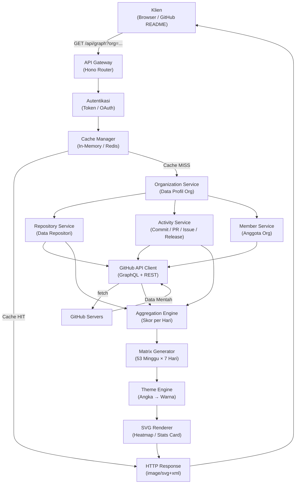

# GitHub Organization Insights

[](https://github.com/)
[](https://www.typescriptlang.org/)
[](https://nodejs.org/)
[](https://hono.dev/)
[](LICENSE)

> Analytics Engine untuk GitHub Organization.
> Contribution Graph hanyalah salah satu outputnya.

## 🎯 Visi Proyek

GitHub Organization Insights adalah platform analytics engine untuk organisasi GitHub. Tujuannya adalah menghasilkan berbagai visualisasi statistik organisasi GitHub secara real-time yang dapat langsung di-embed ke README, website, atau dashboard tanpa perlu GitHub Actions.

Contoh penggunaan:

```md


```

Semua output berupa endpoint SVG dinamis.

---

## 🚀 Fitur Utama

- Dynamic SVG endpoints untuk organisasi GitHub
- Contribution graph seperti GitHub heatmap
- Statistik organisasi dan top repositories
- Cache Redis untuk mengurangi beban GitHub API
- Dukungan public repository, dan akan ditingkatkan untuk private repository melalui GitHub OAuth
- Tema visual yang dapat dipilih (misalnya GitHub Light/Dark)
- Real-time-ish dengan mekanisme invalidasi cache

---

## 🧠 Arsitektur Tinggi

Berikut adalah alur permintaan dari klien hingga SVG dihasilkan:



**Penjelasan alur:**

1. **Klien** (browser atau README) mengirim permintaan ke endpoint `/api/graph`
2. **API Gateway** (Hono) meneruskan ke middleware autentikasi
3. **Cache Manager** dicek — jika data sudah tersedia, SVG langsung dikembalikan tanpa memanggil GitHub
4. Jika **cache miss**, data diambil dari GitHub melalui tiga service paralel:
   - Organization Service (profil organisasi)
   - Repository Service (daftar repositori)
   - Activity Service (commit, PR, issue, release)
5. Semua service menggunakan **GitHub API Client** yang menggabungkan GraphQL (data struktural) dan REST (data time-series)
6. Data mentah dari GitHub masuk ke **Aggregation Engine** yang menghitung skor kontribusi per hari
7. **Matrix Generator** mengubah 365 hari menjadi grid 53×7 (seperti heatmap GitHub)
8. **Theme Engine** memetakan tingkat aktivitas (0–4) ke warna tema yang dipilih
9. **SVG Renderer** menggabungkan matrix + tema + label menjadi file SVG
10. **HTTP Response** dikembalikan ke klien sebagai `image/svg+xml`

---

## 🧩 Komponen Sistem

### 1. API Layer

Endpoint utama bertugas:

- validasi parameter
- parsing query
- authentication
- response

Contoh endpoint:

```http
GET /api/graph?org=openai&theme=github-dark&year=2026
```

### 2. Authentication

Dua mode:

- Anonymous: hanya bisa melihat public repository
- Authenticated: GitHub OAuth, akses private repository jika user anggota organisasi

### 3. Cache Layer

Cache sangat penting untuk menghindari rate limit GitHub.

- Rekomendasi: Redis
- Key pattern contohnya:
  - `graph:openai:github-dark:2026`
- TTL: 15 menit

Jika cache tersedia, server langsung mengembalikan SVG tanpa memanggil GitHub API.

### 4. GitHub API Layer

Dua klien terpisah:

- GraphQL Client untuk Organization, Repository, Member, Languages
- REST Client untuk Commit, Traffic, Contributor, Contents

### 5. Organization Service

Mengambil data organisasi:

- Repository
- Member
- Team
- Permission

### 6. Activity Service

Menormalisasi berbagai aktivitas ke format yang konsisten:

- Commit
- Issue
- PR
- Release
- Discussion
- Wiki

Format internal:

```text
Activity
Date
Weight
Repository
Author
```

### 7. Aggregation Engine

Menggabungkan aktivitas ke dalam rangkaian waktu:

```text
2026-01-01 -> 15
2026-01-02 -> 0
2026-01-03 -> 51
```

### 8. Matrix Generator

Mengubah 365 hari menjadi heatmap 53x7 mirip GitHub.

### 9. Theme Engine

Mengubah angka aktivitas menjadi warna.

Contoh theme:

- GitHub
- Dracula
- Nord
- Catppuccin
- Tokyo Night

### 10. SVG Renderer

Renderer hanya menerima:

- Matrix
- Theme
- Label

lalu menghasilkan SVG.

---

## 📦 Struktur Project

```
src
├── api
│   ├── graph
│   ├── stats
│   ├── contributors
│   └── repositories
├── auth
├── github
│   ├── graphql
│   ├── rest
│   ├── organization
│   ├── repository
│   └── activity
├── services
├── cache
├── core
│   ├── aggregator
│   ├── scorer
│   ├── matrix
│   ├── calendar
│   └── theme
├── renderer
│   ├── svg
│   ├── stats
│   └── graph
├── utils
└── types
```

---

## 🛠️ Tech Stack

- Runtime: Node.js 22 LTS
- Bahasa: TypeScript
- Framework: Hono (ringan, cepat)
- HTTP client: `fetch`
- GitHub API: GraphQL + REST
- Cache: Redis
- SVG rendering: manual string generation
- Deployment: Vercel, Cloudflare Workers, Fly.io

---

## ⚙️ Roadmap

### MVP (v1)

- Contribution Graph SVG
- Dukungan repository publik
- Tema GitHub Light/Dark
- Cache
- Dokumentasi

### v1.5

- GitHub OAuth
- Dukungan repository privat untuk anggota organisasi
- Filter repository
- Filter tahun

### v2

- Statistik organisasi
- Top contributors
- Language distribution
- Timeline aktivitas

### v3

- Dashboard web
- Badge generator
- JSON API
- Webhook GitHub untuk invalidasi cache

---

## 🔥 Cache Invalidation (Rekomendasi)

Lebih baik tidak hanya andalkan TTL. Tambahkan GitHub Webhooks sebagai mekanisme invalidasi cache.

Alur:

1. Organisasi menginstal GitHub App atau webhook
2. GitHub mengirim event saat ada aktivitas
3. Server menghapus cache yang terdampak
4. Request berikutnya membangun ulang SVG terbaru

---

## 🧪 Menjalankan Proyek

1. Salin `.env.example` menjadi `.env`
2. Isi `GITHUB_TOKEN`
3. Jalankan:

```bash
bun install
bun run dev
```

4. Buka browser di `http://localhost:3000`

---

## 💡 Kontribusi

Contributions are welcome! Fokus pada:

- kualitas API
- efisiensi cache
- dukungan data organisasi GitHub
- dokumentasi endpoint

Silakan buka issue atau PR untuk fitur baru dan perbaikan.

---

## 📜 License

This project is intended to be open source. Add your preferred license file.
